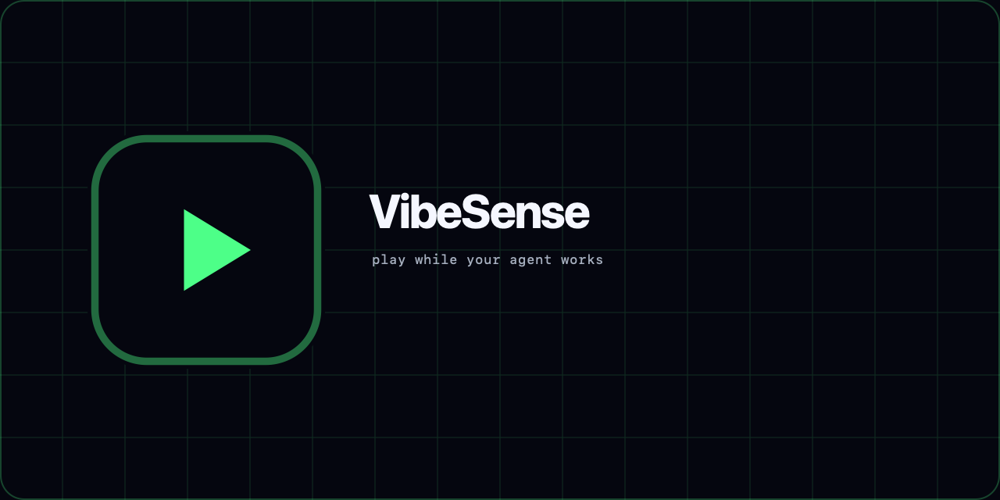

# VibeSense

[](https://www.npmjs.com/package/@vibesense/cli)

Drive Claude Code or Codex CLI with a game controller — and play retro games while the agent works.

`vibesense` wraps an agent CLI in a pty and passes its TUI through to your terminal untouched. Claude Code remains the default; select Codex explicitly:

```sh
vibesense                         # Claude Code (unchanged)
vibesense codex [codex args...]   # Codex CLI
vibesense play [game]             # game only
```

A game controller (Xbox / DualSense / generic HID) drives everything:

- **Agent waiting on you?** D-pad navigates options, A/✕ accepts, B/○ cancels, and the right stick scrolls. Y/△ triggers Claude Code's native voice input; in Codex it sends a normal space.
- **Agent executing?** A retro Snake game auto-starts in a browser tab — left stick steers. The moment the agent stops or asks for approval, the game pauses and the controller flips back to driving the terminal.
- **Want a break?** Menu/Options pauses the game and hands the controller to the terminal; press it again to resume. This manual pause sticks — the agent starting or stopping won't un-pause it.
- **Games are plugins.** Anyone can publish a game as an npm package; official games are `@vibesense/game-<id>`, installed with `vibesense install <id>`.

## How it works

```
controller → OpenMicro                                  ← one host per machine
   │
input router ──(agent waiting/idle)──▶ keystrokes ──▶ node-pty ⇄ claude/codex
   │
   └────────(agent executing)──▶ SSE ──▶ browser tab (game canvas)

agent lifecycle hooks (curl POST) ──▶ http://127.0.0.1:48753 ──▶ agent-state FSM
```

Claude Code behavior and configuration are unchanged: its existing hooks (`UserPromptSubmit`, `Stop`, `Notification`, `PreToolUse:AskUserQuestion`, `PostToolUse`, and `SessionEnd`) are installed idempotently into `~/.claude/settings.json`.

Codex uses four lifecycle hooks: `UserPromptSubmit` starts play, `PermissionRequest` pauses for approval, `PostToolUse` resumes play, and `Stop` pauses and focuses that terminal. VibeSense installs them into `$CODEX_HOME/hooks.json`, or `~/.codex/hooks.json` when `CODEX_HOME` is unset. On first install—and whenever the hook definition changes—open `/hooks` in Codex, inspect the commands, and trust them.

Codex hooks must be enabled and permitted by local or administrator policy. VibeSense does not rewrite `config.toml` or bypass Codex's trust flow. Codex exposes no lifecycle event between approving a tool and that tool starting, so the game may remain paused while the approved tool runs; it resumes on `PostToolUse`.

Multiple wrapped sessions share one host, one controller, and one game—the game pauses whenever any tracked session needs your attention. Globally installed hooks from unrelated Claude and Codex sessions are ignored.

Terminal buttons and game buttons are disjoint sets, with a 750 ms input guard on every mode flip — mashing fire can never accidentally accept a question.

`vibesense play [game]` runs the game with no agent session at all. Add `--auto-play` (works in either mode, off by default) to keep the game running non-stop — on macOS it also keeps the machine awake and resets the OS idle timer (`caffeinate -disu`), so no sleep and no Teams/Slack "Away". `vibesense --version` (or `-v`) prints the installed version.

## Games marketplace

Five games ship built in; browse and install the rest from the catalog at [vibesense.dev/games](https://vibesense.dev/games). The official installable games live in [vibesense-games](https://github.com/stephenleo/vibesense-games), and [vibesense-game-template](https://github.com/stephenleo/vibesense-game-template) is the starting point for building your own.

```sh
vibesense games            # list installed games (* = active)
vibesense install <id>     # install @vibesense/game-<id> from npm (tarballs/paths work too)
vibesense use <id>         # switch the active game
vibesense uninstall <id>
```

A game is an npm package `@vibesense/game-<id>` with a `vibesense-game.json` manifest — either a `web` game (canvas page served to the game tab) or an `external` adapter (shell commands on state transitions, e.g. launching/pausing a Steam game). See [docs/plugin-contract.md](docs/plugin-contract.md) to build one. Premium games are a reserved manifest field (`entitlement: "premium"`) with the activation gate already in place — licensing bolts on later without changing the contract.

> **Trust model**: installing a game is installing an npm package, and `external` games run shell commands by design. Only install games from authors you trust — same judgement as adding any dependency.

## Install

```sh
npm install -g @vibesense/cli    # or: npx @vibesense/cli
```

Requires **Node ≥22**, and is **macOS-first**. OpenMicro handles controller discovery, verification, normalized input, and reconnection. Run `npx openmicro@1.3.0 doctor` to verify a controller. The native deps `node-hid` (through OpenMicro) / `node-pty` compile on install, so you'll need build tools (Xcode Command Line Tools on macOS).

> **npm 12+**: dependency install scripts are blocked by default, which silently skips the native builds and breaks vibesense at startup. Approve them at install time:
>
> ```sh
> npm install -g @vibesense/cli --allow-scripts=@vibesense/cli,node-pty,node-hid
> ```
>
> Already installed and hitting a native-module error? Re-run the command above. On npm ≤11 the plain install works as-is.

## Development

```sh
npm install
npm run dev        # run from source (tsx)
npm run verify     # typecheck + lint + format-check + tests
```

Only one vibesense can own the singleton port (48753). Set `VIBESENSE_PORT` to
run a second instance beside a live session:

```sh
VIBESENSE_PORT=48754 npm run dev -- play snake   # game at http://127.0.0.1:48754
```
