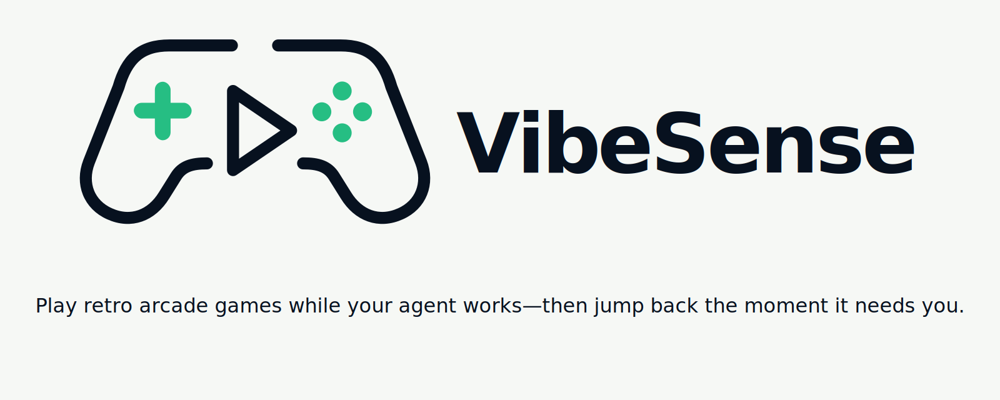

<p align="center">
  <picture>
    <source media="(prefers-color-scheme: dark)" srcset="assets/vibesense-logo-dark.svg">
    <source media="(prefers-color-scheme: light)" srcset="assets/vibesense-logo-light.svg">
    
  </picture>
</p>

# VibeSense

[](https://www.npmjs.com/package/@vibesense/cli)

Play retro arcade games while your agent works—then jump back the moment it needs you.

VibeSense wraps Claude Code or Codex CLI, or drives the Codex desktop app on macOS. It tracks agent lifecycle hooks and switches one game controller between a browser game and the agent.

## What VibeSense does

- Starts the active game when the wrapped agent begins working, then pauses it when the agent stops or needs approval.
- Routes controller input to the terminal while the agent needs you and to the game while it is running.
- Ships five browser games and supports installable web games and external game adapters.
- Wraps Claude Code by default and supports Codex CLI plus the Codex desktop app.
- Shares one controller, game, and local host across multiple wrapped sessions.
- Provides standalone play and optional continuous-play modes when no agent-driven handoff is wanted.

## Requirements

- Node.js 22 or newer.
- macOS is the primary supported platform. Automatic browser opening and keep-awake behavior are macOS-specific.
- A controller supported by the installed OpenMicro version. Compatibility depends on the device and connection; generic HID support is best-effort.
- Native build tools for `node-pty` and OpenMicro's `node-hid` dependency, such as Xcode Command Line Tools on macOS.
- Codex app mode requires the Codex macOS app and Accessibility/Automation permission for the terminal running VibeSense.

Verify the controller before starting:

```sh
npx openmicro@1.3.0 doctor
```

## Install

```sh
npm install -g @vibesense/cli
```

On npm 12 and newer, approve the required native install scripts explicitly:

```sh
npm install -g @vibesense/cli --allow-scripts=@vibesense/cli,node-pty,node-hid
```

You can also run VibeSense without a global install:

```sh
npx @vibesense/cli
```

## Quick start

```sh
vibesense                         # wrap Claude Code
vibesense codex                   # wrap Codex CLI
vibesense codex-app               # drive the Codex desktop app (macOS)
vibesense play snake              # play without an agent
```

Arguments after `vibesense` are forwarded to Claude Code. Arguments after `vibesense codex` are forwarded to Codex CLI. `vibesense codex-app` is a no-PTY GUI mode and accepts only VibeSense options such as `--no-game` and `--auto-play`.

## Commands and options

| Command                             | Behavior                                                                     |
| ----------------------------------- | ---------------------------------------------------------------------------- |
| `vibesense [claude args...]`        | Wrap Claude Code.                                                            |
| `vibesense codex [codex args...]`   | Wrap Codex CLI.                                                              |
| `vibesense codex-app`               | Launch and drive the Codex desktop app on macOS without a PTY.               |
| `vibesense play [game]`             | Play without an agent; named selection supports installed web games.         |
| `vibesense games`                   | List installed games; `*` marks the active game.                             |
| `vibesense install <id-or-package>` | Install an official game ID, npm package, tarball, URL, or local path.       |
| `vibesense use <id>`                | Make an installed game active.                                               |
| `vibesense uninstall <id>`          | Uninstall a game.                                                            |
| `vibesense login <token>`           | Store a marketplace token and attempt validation; defer it if unreachable.   |
| `vibesense logout`                  | Remove the marketplace token and cached entitlements.                        |
| `--no-game`                         | Do not automatically open the browser game tab.                              |
| `--auto-play`                       | Keep the game running independently of agent state; Menu can still pause it. |
| `--help`, `-h`                      | Show command help, including the no-PTY Codex app mode.                      |
| `--version`, `-v`                   | Print the installed VibeSense version.                                       |

`--auto-play` also starts `caffeinate -disu` on macOS for the lifetime of VibeSense, preventing system idle sleep and resetting the OS idle timer. Other platforms still keep the game running but do not receive this keep-awake integration.

## Agents and handoff

### Claude Code

VibeSense installs its lifecycle hooks idempotently into `~/.claude/settings.json`, preserving unrelated settings and hooks. Claude Code remains the default agent, so existing arguments continue to work after the `vibesense` command.

### Codex CLI

Run Codex with `vibesense codex`. VibeSense installs hooks into `$CODEX_HOME/hooks.json`, or `~/.codex/hooks.json` when `CODEX_HOME` is unset. After the first install or a hook-definition change, open `/hooks` in Codex, inspect the commands, and trust the VibeSense hooks.

Codex must permit hooks through its local or administrator policy. VibeSense does not edit `config.toml`, bypass trust, or override policy. Codex exposes no lifecycle event between approving a tool and that tool starting, so the game can remain paused until the following `PostToolUse` event.

### Codex desktop app

Run `vibesense codex-app` on macOS. VibeSense launches Codex without a PTY and delegates app control to OpenMicro's exported `codex-app` harness. The south button accepts, east rejects or dismisses, north holds push-to-talk, and the D-pad sends arrow keys. Touchpad cycles chats in the current project; L2/LT cycles projects. Each action targets the session that Codex brings frontmost. Continuous right-stick scrolling is intentionally unavailable because the shared app harness has no verified equivalent.

On first use, allow the terminal running VibeSense under **System Settings → Privacy & Security → Accessibility** and **Automation** so it can control System Events and Codex. Codex's `Control+Shift+D` dictation shortcut must remain available for north-button push-to-talk; the other mapped controls use standard Enter, Escape, and arrow keys.

Codex app mode installs both VibeSense's state hook and OpenMicro's shared harness hook in `$CODEX_HOME/hooks.json` (normally `~/.codex/hooks.json`). After the first install or any hook-definition change, open `/hooks` in Codex, inspect the VibeSense and OpenMicro commands, and trust them. Hooks are the state source for the shared Codex host: any headerless non-Claude Codex hook can pause the game when it needs attention, including Codex Desktop sessions in other projects and unwrapped Codex CLI sessions. Controller actions still target whichever Desktop session is frontmost. VibeSense does not copy OpenMicro's GUI or database automation.

## Controller behavior

OpenMicro owns controller discovery, verification, normalized input, reconnection, and hardware lifecycle. VibeSense consumes those normalized events and decides whether they belong to the agent terminal, game, or game picker.

| Context        | Controls                                                                                                                                                                                                                           |
| -------------- | ---------------------------------------------------------------------------------------------------------------------------------------------------------------------------------------------------------------------------------- |
| Agent terminal | D-pad sends arrow keys; south button accepts; east button cancels; right stick scrolls; north button sends space. In Claude Code, that space invokes its native voice shortcut when configured; Codex CLI receives a normal space. |
| Codex app      | D-pad sends arrow keys; south accepts; east rejects; north holds push-to-talk; Touchpad cycles chats; L2/LT cycles projects. Continuous right-stick scrolling is unmapped.                                                         |
| Browser game   | Left stick and R2/L2 are forwarded to the game. Each game shows its exact controls in the sidebar.                                                                                                                                 |
| Game picker    | View/Share opens the picker; D-pad selects; south confirms; east or View/Share cancels.                                                                                                                                            |
| Any mode       | Menu/Options manually pauses or resumes the game.                                                                                                                                                                                  |

Every terminal/game transition applies a 750 ms guard and ignores buttons held across the mode change, preventing game input from accidentally accepting an agent prompt.

## Games

VibeSense includes five web games: Snake, Stax, Chompers, Brickfall, and Rockfield. Browse more at [vibesense.dev/games](https://vibesense.dev/games), or use the official [vibesense-games](https://github.com/stephenleo/vibesense-games) packages.

Games use a versioned `vibesense-game.json` manifest:

- `web` games are local HTML and JavaScript served by VibeSense and controlled over Server-Sent Events.
- `external` games provide optional start, pause, resume, and stop shell commands; they handle controller input themselves.

Named `vibesense play <game>` selection is limited to installed web games. To run an external adapter without an agent, make it active with `vibesense use <id>`, then run bare `vibesense play`.

Installed games live under `~/.vibesense/games`, and the active game plus marketplace credentials are stored in `~/.vibesense/config.json`. Marketplace tokens are written with user-only file permissions, and cached entitlements provide offline grace for previously validated purchases.

Start with the [game-building guide](docs/building-a-game.md), read the [protocol v1 contract](docs/plugin-contract.md), or use [vibesense-game-template](https://github.com/stephenleo/vibesense-game-template).

> Installing a game installs an npm package. External games also execute their declared shell commands by design. Install games only from authors you trust.

## Architecture

```text
controller → OpenMicro → VibeSense input router
                              ├─ agent waiting → OpenMicro action → Codex app
                              ├─ agent waiting → keystrokes → node-pty ↔ Claude/Codex CLI
                              └─ agent working → SSE input/state → browser game

agent lifecycle hooks → http://127.0.0.1:48753 → shared agent-state host
```

The first VibeSense process to bind the local port becomes the host and owns the controller and game. Later wrapped CLI processes register as clients. Codex app mode must be the host because GUI sessions cannot inherit a wrapper ID. Its shared game pauses whenever any Codex Desktop session needs attention.

Only one host can use the default port `48753`. For a second development instance, choose another port:

```sh
VIBESENSE_PORT=48754 npm run dev -- play snake
```

## Development

```sh
npm install
npm run dev
npm run verify
npm run build
```

`npm run verify` runs typechecking, lint, formatting checks, and the complete test suite.
