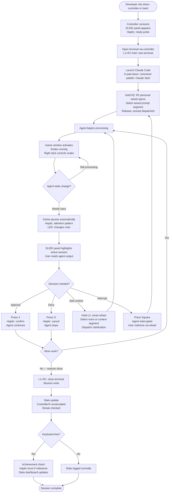
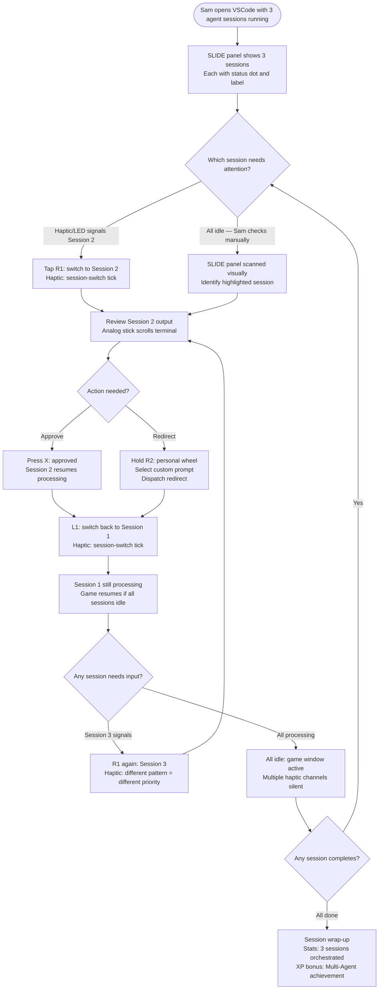

# UX Design Specification vibesense

**Author:** Leo
**Date:** 2026-03-29

---

<!-- UX design content will be appended sequentially through collaborative workflow steps -->

## Executive Summary

### Project Vision

VibeSense is a VSCode extension that replaces the keyboard as the primary input device for agentic AI coding ("vibe coding"). As AI agents handle implementation, developers spend their time on 8–10 distinct repetitive interactions — approving decisions, dispatching prompts, scrolling output, and waiting. VibeSense maps these to a gaming controller held in a natural two-handed grip, enabling a relaxed posture away from the desk. When the agent is processing, the controller transitions to retro mini-games that pause automatically when attention is needed — transforming idle wait time from passive distraction into active play.

The central UX claim is not that a controller is a *usable* input device for coding — it's that a controller is the *correct* input device for vibe coding. The experience is designed around a single click moment: a developer realizes they haven't touched the keyboard in two hours and didn't notice.

### Target Users

**Primary — Alex (Gamer-Developer):** Software developer who vibe codes daily and already owns a controller. Seeks ergonomic relief from desk posture and a better idle-time loop during AI processing. Zero hardware friction — the controller is already in their hands.

**Secondary — Jordan (Coding Streamer/Content Creator):** Streams or records vibe coding content. Needs visual distinctiveness and engagement during AI processing dead air. VibeSense's HUD overlay and mini-game moments become content signatures.

**Secondary — Sam (Multi-Agent Power Developer):** Runs 3–4 parallel AI agent sessions simultaneously. Primary need is orchestration efficiency — switching between sessions without keyboard/mouse context switching. Haptic and LED feedback reduces cognitive load across sessions.

### Key Design Challenges

1. **Zero-friction onboarding to "aha" moment** — Users must complete their first controller-only session within 60 seconds of install. Onboarding must adapt to PS5/Xbox button iconography without a single text-heavy screen and work across controller types automatically.

2. **Ambient multi-session feedback** — For Sam's use case, the HUD must communicate which agent needs attention without requiring eye contact. Haptics and LED carry critical UX weight; the visual layer (HUD) must reinforce, not replace, the physical feedback channel.

3. **Radial wheel discoverability and learnability** — The 8-segment prompt radial wheel is the signature interaction but radial menus have inherent learnability challenges. The UX must make segments feel intuitive out-of-the-box while supporting deep customization without overwhelming new users.

### Design Opportunities

1. **Gamification as native UX language** — VibeSense lives in gaming-familiar territory. XP, levels, achievements, and streaks can extend beyond the stats dashboard into the core interaction model, making every session feel rewarding rather than utilitarian.

2. **The idle-to-active transition as a brand moment** — The instant the controller shifts from vibe-coding input to mini-game controller is a signature micro-interaction. A well-designed haptic pattern + visual cue here becomes the most memorable moment in the product — and the most shareable.

3. **Streaming Mode as living product demo** — Jordan's overlay isn't just a utility feature; it's the product's marketing surface. Designing it to be visually striking and distinctively branded means every stream using VibeSense is an organic product demonstration to thousands of developers.

## Core User Experience

### Defining Experience

The heartbeat of VibeSense is the **approval/denial loop** — the moment an AI agent completes a task and the developer reviews and accepts or rejects it. This happens dozens of times per session. Face button taps (X/A = approve, Circle/B = deny) must feel instant, reliable, and satisfying. The radial prompt wheel is the signature interaction, but the approve/deny loop is what the entire session rhythm is built on.

The full experience loop is: **dispatch prompt → wait (play mini-game) → agent completes → review output → approve/deny → repeat.** Every UX decision should reinforce this loop, not interrupt it.

### Platform Strategy

- **Platform:** VSCode extension (desktop, cross-platform — macOS at MVP, Linux pre-Marketplace, Windows in growth tier)
- **Primary input device:** HID-compatible gaming controller replacing keyboard/mouse during vibe coding sessions
- **Keyboard/mouse:** Always available as fallback — VibeSense overlays on the existing IDE experience, never replacing it
- **Display surfaces:** VSCode HUD overlay (in-editor) and OBS-compatible streaming overlay (Jordan's use case)
- **Connectivity:** Fully offline — no network required for core functionality
- **Controller hardware:** DualSense (PS5) and Xbox Series at launch; any HID-compatible controller with basic mapping

### Effortless Interactions

These interactions must require zero conscious thought — they should feel like muscle memory from the first session:

- **Controller auto-detection on launch** — no configuration, no manual pairing; VibeSense finds the controller and presents its icon set automatically
- **Agent state → mini-game transition** — fully automatic; the mini-game launches when the agent starts processing and pauses the instant it needs attention; the user never manages this manually
- **Session switching (L1/R1)** — maps directly to gaming shoulder button conventions; muscle memory from gaming transfers without relearning
- **Onboarding icon recognition** — tutorial uses the actual PS/Xbox button icons from the physical controller; no translation layer, no abstraction

### Critical Success Moments

1. **First auto-detect** — controller connects, VibeSense recognizes it immediately with zero configuration. The first 10 seconds establish trust: "it already knows my controller."
2. **First approve via face button** — the core loop fires for the first time. Simple, immediate, satisfying. "Oh, this just works."
3. **First mini-game auto-launch** — agent starts processing, Snake appears without any user action. The idle-to-active transition lands as delight, not confusion.
4. **First keyboard-free session** — the north star moment. Likely happens in session 2–3 after muscle memory forms. The user realizes they haven't touched the keyboard in 90+ minutes.

### Experience Principles

1. **Controller-first, always** — every design decision starts from "how does this feel in two hands, held from the couch" — not "how does this look on a screen." If an interaction requires looking at the keyboard, it's a design failure.

2. **Zero-step defaults** — the out-of-the-box configuration must be production-ready for Alex with no setup. Customization is for power users, not a prerequisite for basic use.

3. **Physical feedback leads, visual follows** — haptics and audio communicate agent state first; the HUD confirms. Users should never need eyes-on-screen for critical state awareness.

4. **Transitions are the product** — the approve→wait→play→pause→approve loop is not a series of modes, it's one continuous designed experience. Every state transition (coding to idle, idle to alert, alert back to coding) should feel intentional, not accidental.

## Desired Emotional Response

### Primary Emotional Goals

**Primary: "In the zone"** — VibeSense should make users feel like they're playing a game, not doing chores. The feeling is not "I'm efficiently approving code changes" — it's "I'm the conductor of something cool." Flow state, not productivity grind.

**Secondary: Pride** — the north star moment (keyboard-free session) should leave users feeling genuinely proud of a new capability, not just satisfied with a tool.

**Tertiary: Belonging** — achievements, levels, and the eventual community marketplace should make users feel part of something, not just using a utility.

### Emotional Journey Mapping

| Stage | Target Feeling |
|---|---|
| First launch / auto-detect | **Impressed** — "it already knows my controller" |
| Onboarding tutorial | **Confident** — "I already know these buttons" |
| First approve/deny | **Satisfied** — clean, tactile, immediate feedback |
| First mini-game auto-launch | **Delighted** — surprised and pleased, not confused |
| First keyboard-free session | **Proud** — "I did that without touching the keyboard" |
| Returning user | **Excited** — looking forward to the session loop, not dreading a tool |
| Controller disconnect / error | **Secure** — graceful fallback, no panic, no lost work |

### Micro-Emotions

- **Confidence over confusion** — button icons must match the physical device at all times; no guessing, no translation
- **Delight over mere satisfaction** — transition moments (idle → game, game → alert) should pleasantly surprise every time, not just the first
- **Belonging over isolation** — achievements and streaks surface wins, not failures; the experience feels communal even in solo use
- **Security over anxiety** — controller disconnect activates keyboard fallback silently; no modal errors, no dead ends

### Design Implications

- **In the zone** → session rhythm must be uninterrupted; agent state changes use haptic/LED first, visual second; zero pop-ups during active coding
- **Delight at transitions** → the idle→game and game→alert micro-interactions receive dedicated haptic signatures and animation; they are designed brand moments, not incidental state changes
- **Confidence** → button prompts always render the actual PS/Xbox icons from the detected controller; never generic gamepad icons
- **Security** → keyboard fallback activates without any error state or UX disruption; status bar indicator is always visible but never alarming
- **Belonging** → the stats dashboard and achievement system celebrate milestones with haptic celebrations and visual flair; failure states are silent and recoverable

### Emotional Design Principles

1. **Make the wait the reward** — idle AI processing time transforms from frustration into anticipation; the mini-game is the treat, not the consolation prize
2. **Every state change is a felt moment** — haptics mean the body knows what's happening before the eyes do; design for proprioception, not just visual feedback
3. **Celebrate the right thing** — the product's north star (keyboard-free sessions) should be the thing users feel proud of, so achievements and streaks must reinforce controller-first behavior specifically
4. **Earn trust in the first 30 seconds** — auto-detect, correct button icons, and a working approve interaction must all happen before the user finishes the onboarding tutorial; trust cannot be asked for, only demonstrated

## UX Pattern Analysis & Inspiration

### Inspiring Products Analysis

**Steam / Steam Input**
Steam's radial menus, per-game controller profiles, and hardware-adaptive button icon sets are the closest existing analog to VibeSense's interaction model. Big Picture Mode demonstrates what a "controller-first" UI layer on top of a desktop experience can feel like. Key lesson: the profile-per-context model (per-project bindings) and hardware detection with correct icon rendering are both proven patterns worth adopting directly.
What to avoid: Steam's controller binding configuration UI is powerful but deeply intimidating to new users — the depth is only accessible after significant investment. VibeSense must invert this: zero-config first, depth optional.

**Duolingo**
Best-in-class streak mechanics, gentle failure recovery, and celebration micro-interactions (confetti, haptic bursts on achievement unlock) that make habit formation feel genuinely rewarding rather than gamified-for-its-own-sake. Their core insight: celebrate the behavior you want repeated, not just task completion.
What to adapt: daily streak → session streak; XP → controller action ratio; achievement celebrations → haptic signature + visual burst on keyboard-free session completion.

**VSCode itself**
The status bar is the gold standard for ambient information in a developer tool — always present, never modal, readable at a glance without interrupting focus. The extension API and Settings UI set user expectations for how a plugin integrates without taking over the host application.
What to adopt wholesale: status bar controller state indicator follows VSCode's own visual conventions; users read it instinctively without learning anything new.

**Superhuman**
Keyboard-shortcut-first design where contextual hints teach shortcuts inline and fade as muscle memory forms. The "speed" feeling is engineered through instant visual feedback on every action — the UI responds before the user consciously processes the action.
What to adapt: radial wheel segment labels that fade with usage — new users see descriptive labels, experienced users see a clean icon-only wheel. The goal is the same: zero friction after the first 10 uses.

### Transferable UX Patterns

| Pattern | Source | VibeSense Application |
|---|---|---|
| Hardware-adaptive button icons | Steam | Detect DualSense vs. Xbox on connect; render correct button icons everywhere, instantly, with no configuration |
| Ambient status bar indicator | VSCode | Controller connection state and active session count — always visible at bottom of editor, never modal or intrusive |
| Streak + celebration micro-interactions | Duolingo | Keyboard-free session streaks with dedicated haptic signature + visual celebration on milestone completion |
| Contextual shortcut teaching that fades | Superhuman | Radial wheel segment labels fade as usage count builds; power users see a clean icon-only wheel; new users see descriptive hints |
| Per-context profile switching | Steam Input | Per-project binding profiles (`.vscode/vibesense.json`) with shoulder-button profile cycling for multi-context developers |

### Anti-Patterns to Avoid

- **Configuration-first onboarding** (Steam binding UI) — VibeSense must be production-ready with zero setup; every configuration screen is a drop-off risk for a developer who just wanted to try it
- **Interruptive modal notifications** (most productivity tools) — agent state changes must never break typing or reading flow; haptics notify the body first, visuals confirm second, modals never
- **Generic gamepad icons** (Joy2Key, reWASD) — rendering a generic gamepad icon when the hardware is a DualSense or Xbox controller is a small but trust-breaking UX miss that signals the product doesn't know its users
- **Punitive failure states** — controller disconnect, missed agent completions, and mini-game deaths must all recover silently and automatically; no error screens, no lost state, no recovery flow required from the user

### Design Inspiration Strategy

**Adopt directly:**
- VSCode status bar conventions for controller state display
- Steam's hardware-detected icon sets (PS/Xbox button glyphs)
- Duolingo's milestone celebration pattern (haptic + visual burst on keyboard-free session achievement)

**Adapt for VibeSense:**
- Steam's radial menu → 8-segment prompt wheel with project-specific presets and contextual label fading
- Duolingo's streak mechanic → controller action ratio trend + session streak, displayed in stats dashboard
- Superhuman's shortcut teaching → radial wheel labels that reduce as muscle memory builds

**Avoid entirely:**
- Any configuration-gate before first use
- Modal or toast notifications during active coding sessions
- Generic or platform-ambiguous controller iconography

## Design System Foundation

### Design System Choice

**Custom design system built on VSCode CSS variables**, with Tailwind CSS as a utility layer for standard layout surfaces (settings panel, list views, configuration webviews).

The VSCode CSS variable foundation (`--vscode-*`) provides automatic dark/light/high-contrast theme switching and ensures the extension integrates natively with the host IDE. The custom VibeSense design token layer sits on top, providing the gaming aesthetic across all bespoke surfaces (HUD overlay, radial wheel, stats dashboard, streaming overlay, mini-game canvas).

### Rationale for Selection

- **Full creative control** — the HUD, radial wheel, idle→game transition, and streaming overlay are signature brand moments that no component library can provide. They must be designed, not assembled from utilities.
- **Gaming aesthetic requirements** — achieving a PS5 UI-inspired dark theme with neon/electric accents, glow/bloom effects, and spring-based motion requires a purpose-built design token system, not CSS utility defaults.
- **VSCode integration** — `--vscode-*` variables handle theme awareness automatically; settings UI and status bar feel native to the host application without extra effort.
- **Tailwind efficiency** — Tailwind handles standard layout surfaces (settings panels, form controls, list views) at speed, without fighting against the custom aesthetic layer.

### Implementation Approach

**Aesthetic direction: Gaming peripheral companion software**
- Dark base inspired by PS5 UI and Steam Deck — near-black backgrounds, not VSCode grey
- Electric accent palette: primary cyan (#00D4FF), secondary purple (#9B59FF), with PS button colors (pink, blue) and Xbox button colors (green, yellow, red, blue) as semantic tokens
- Subtle glow/bloom on interactive elements (radial wheel segments, active session indicators, achievement unlocks)
- Bold geometric typography — confident weight, not developer-tool default
- Spring-based motion curves for state transitions; easing that feels physical, not linear

**Surface-by-surface approach:**
- **Status bar indicator** — native VSCode component; inherits host theme; no custom styling needed
- **Settings UI webview** — Tailwind utility layer over VSCode variables; clean, legible, functional
- **HUD overlay** — fully custom; gaming aesthetic; CSS custom properties + SVG components
- **Radial wheel** — SVG-based; custom geometry; animated with spring physics
- **Stats dashboard** — custom webview; full gaming aesthetic with charts, streaks, achievement grid
- **Mini-game canvas** — HTML5 Canvas; pixel-art or clean vector aesthetic; no CSS framework applies
- **Streaming overlay** — custom CSS; optimized for OBS capture; visually distinctive and brandable

### Customization Strategy

**Design token layer (CSS custom properties on top of `--vscode-*`):**
- Color tokens: `--vs-accent-primary`, `--vs-accent-secondary`, `--vs-glow-color`, `--vs-surface-hud`, `--vs-controller-[button]`
- Motion tokens: `--vs-duration-fast` (120ms), `--vs-duration-base` (240ms), `--vs-duration-slow` (400ms), `--vs-easing-spring`
- Controller icon tokens: auto-switched SVG sprite based on detected hardware (DualSense vs. Xbox vs. generic HID)

**Component set (bespoke, no external library):**
- `RadialWheel` — 8-segment SVG menu with label-fading and spring-open animation
- `HUDOverlay` — floating button map display with session state indicator
- `SessionPanel` — multi-agent session quick-switcher with per-session status
- `ControllerIcon` — hardware-adaptive button glyph (auto-selects PS/Xbox/generic sprite)
- `AchievementToast` — haptic-paired celebratory visual burst (non-modal, non-intrusive)
- `StatsCard` — streak, XP, and controller action ratio display components

## Core User Experience

### 2.1 Defining Experience

> **Hold L2 or R2 → tilt right stick to your prompt → release to dispatch.**

The dual radial wheel is VibeSense's defining interaction — the one users describe to friends, clip on stream, and recognize as uniquely VibeSense. It's not the most-used interaction (approve/deny holds that position), but it's the one that makes the product feel like nothing else in the developer tools space.

Two distinct wheels serve two distinct purposes:
- **L2 wheel (Smart/System):** Agent-state actions, voice mode trigger, and AI-detected most-frequent prompts surfaced from terminal history. Works immediately out of the box. Gets smarter over time.
- **R2 wheel (Personal):** Fully user-defined prompts. Blank on first install, progressively filled. Per-project presets via `.vscode/vibesense.json`.

### 2.2 User Mental Model

Users arriving at VibeSense are gamers. They already know radial menus from GTA (weapon wheel), Halo (comms wheel), and Baldur's Gate 3 (action ring). The mental model is pre-loaded: hold trigger → tilt toward segment → release to select. The only novel element is that segments dispatch AI prompts instead of weapons or emotes — the input mechanic itself requires zero relearning.

The dual-wheel layout (both visible simultaneously, layered with depth) makes the system self-teaching: users see both wheels the moment either trigger is pressed. No documentation required to discover the second wheel exists.

**What users hate about current alternatives:** Reaching for the keyboard to type a prompt breaks posture, interrupts flow, and collapses the "couch coding" state. Switching to a chat panel requires eyes-on-screen context switching. The radial wheel eliminates both.

### 2.3 Success Criteria

- **Open speed:** Both wheels appear in <25ms from trigger press — snaps into existence, not animated in
- **Swap speed:** Active/inactive wheel exchange completes in ~50ms — a shuffle, not a slide
- **Eyes-free dispatch:** After ~10 sessions, user can dispatch top 3 prompts without looking at the wheel
- **No misfires:** Dead zone at stick center means no segment is pre-selected on open; accidental dispatch is impossible
- **Immediate utility:** L2 smart wheel works on first launch with zero configuration

### 2.4 Novel UX Patterns

The radial menu mechanic is **established** (borrowed directly from gaming). What is novel:

**Dual layered wheel system** — both wheels visible simultaneously when either trigger is pressed, stacked with depth cues (scale + opacity). The active wheel is centered, full size, full opacity; the inactive wheel is offset, slightly smaller, slightly dimmed — like two cards in a hand with one played forward. Pressing the opposite trigger swaps foreground/background in ~50ms.

**Spatial trigger-to-wheel mapping** — L2 (left trigger) maps to a wheel offset left; R2 (right trigger) maps to a wheel offset right. The physical position of the triggers matches the visual position of their wheels. The controller's own layout teaches the UI.

**Label-fading progression** — wheel segment labels reduce as usage builds, transitioning from full text → short abbreviation → icon-only. New users get descriptive hints; experienced users get a clean, uncluttered wheel. Configurable; power users can force icon-only from day one.

### 2.5 Experience Mechanics

**Wheel open sequence:**

| Gesture | Result |
|---|---|
| Hold L2 | Both wheels snap open (<25ms); L2 wheel centered (active), R2 wheel offset right (receded, dimmed) |
| Hold R2 | Both wheels snap open (<25ms); R2 wheel centered (active), L2 wheel offset left (receded, dimmed) |
| Hold L2 → press R2 | R2 slides forward to center; L2 steps back to offset left (~50ms ease-out) |
| Hold R2 → press L2 | L2 slides forward to center; R2 steps back to offset right (~50ms ease-out) |
| Release active (centered) trigger | Selected segment dispatches; both wheels collapse; confirmation haptic |
| Return stick to center → release active trigger | Cancel; both wheels collapse; subtle dismiss haptic |
| Release non-active (receded) trigger | No action |

**Segment navigation:**
- Right stick controls selection across both wheels; follows the active (centered) wheel
- Each segment entry triggers a haptic tick
- Holding on a segment for ~200ms previews the full prompt text below the wheel
- Active segment scales up with glow; inactive segments dim slightly

**Visual depth system:**
- Active wheel: full size, full opacity, crisp rendering, glow on highlighted segment
- Inactive wheel: ~85% scale, ~50% opacity, subtle blur — clearly present but secondary
- Depth shadow under active wheel reinforces layering
- Both wheels collapse simultaneously on dispatch or cancel

## Visual Design Foundation

**Selected Theme: VOID**
PS5-inspired · Deep navy blacks · Electric cyan + purple · Premium & sleek

### Color System

**Palette:**

| Token | Value | Usage |
|---|---|---|
| `--vs-bg` | `#09090F` | Primary background — near-black with subtle blue cast |
| `--vs-surface` | `#0E0E1C` | Card and panel surfaces |
| `--vs-surface2` | `#13132A` | Nested surfaces, hover states |
| `--vs-accent` | `#00C8FF` | Primary accent — electric cyan; interactive elements, active states, north star moments |
| `--vs-accent2` | `#7B5CFA` | Secondary accent — purple; achievements, R2 wheel, XP bar gradient end |
| `--vs-text` | `#EFF4FF` | Primary text — cool white with blue undertone |
| `--vs-text2` | `#7A8BAA` | Secondary text, labels, captions |
| `--vs-border` | `rgba(0,200,255,0.18)` | Borders and dividers |
| `--vs-glow` | `rgba(0,200,255,0.35)` | Cyan glow for active elements |
| `--vs-glow2` | `rgba(123,92,250,0.35)` | Purple glow for achievements and R2 wheel |

**Controller button semantic colors (hardware-matched):**
- Cross/A: `#4A90D9` (PS blue / Xbox blue)
- Circle/B: `#E05555` (PS red / Xbox red)
- Square/X: `#D45FC9` (PS pink / Xbox no-map)
- Triangle/Y: `#4DB89A` (PS green / Xbox yellow — approximated)

**Accessibility:** All text/background combinations meet WCAG AA (4.5:1 minimum). Cyan `#00C8FF` on `#09090F` = 8.1:1 contrast ratio.

### Typography System

**Typeface:** Inter (system fallback: `system-ui, -apple-system, sans-serif`)
Inter is geometric, highly legible at small sizes, and widely used in modern developer tools and gaming UIs. No custom font loading required — system Inter where available.

**Type scale:**

| Role | Size | Weight | Usage |
|---|---|---|---|
| Display | 32px | 800 | App name, major headings |
| H2 | 20px | 700 | Section headers, panel titles |
| H3 | 14px | 700 | Card titles, group labels |
| Body | 13px | 400 | Descriptions, settings text |
| Caption | 11px | 400 | Timestamps, metadata, status text |
| Label | 10px | 700 | Button labels, badge text, ALL CAPS sections |
| Accent | 13px | 700 | Achievement messages, success states — cyan with glow |

**Letter spacing:** −0.5px on Display/H2 (tight, confident); +1px on Label (readable at small all-caps).

### Spacing & Layout Foundation

**Base unit:** 4px. All spacing is multiples of 4.

| Scale | Value | Usage |
|---|---|---|
| xs | 4px | Icon padding, tight internal spacing |
| sm | 8px | Component internal padding |
| md | 12px | Card padding, between related elements |
| lg | 16px | Section padding, between components |
| xl | 24px | Panel padding, major sections |
| 2xl | 32px+ | Page-level spacing |

**Border radius:** 10px for cards/panels; 8px for buttons; 6px for chips/tags; 50% for dots/avatars.

**Layout approach:** Dense and efficient — this is a developer tool overlay, not a marketing page. Information should be readable at a glance. No wasted whitespace; every pixel earns its place.

### Accessibility Considerations

- All color communication has a non-color fallback (shape, label, or icon)
- Controller connection state uses both color (green dot) and text label
- Agent state uses both color (accent dot pulsing) and text status
- HUD overlay respects VSCode's built-in high-contrast theme via `--vscode-*` variable override
- Font sizes never below 10px; interactive touch targets minimum 28×28px
- Motion respects `prefers-reduced-motion` — all animations disable gracefully; haptic feedback unaffected

## Design Direction Decision

### Design Directions Explored

Six layout directions were evaluated, all using the VOID theme:

1. **WHISPER** — Near-invisible single pill indicator; maximum editor focus; low discoverability
2. **ORBIT** — Floating modular chips at editor edges; positionable; medium screen presence
3. **COMMAND** — Full sidebar panel; dense information hierarchy; best for multi-agent power use
4. **CINEMA** — Game band overlaid on dimmed editor; most dramatic; ideal for streaming
5. **SLIDE** — Translucent panel slides in from right edge; balanced presence; works for all personas
6. **CENTERED** — Orbital HUD radiates from center; most visually distinctive; maximum streaming impact

### Chosen Direction

**Primary: SLIDE + Detached Game Window**

The SLIDE panel is the persistent work overlay. The mini-game lives in a separate VSCode `WebviewPanel` that opens as a bottom panel tab by default and can be dragged out to its own window — enabling the dual-screen use case where game runs on a secondary monitor while the IDE occupies the primary screen.

**Secondary (Streaming Mode): CINEMA**

When Jordan toggles Streaming Mode, the game band overlays the editor in CINEMA style for maximum camera presence. This is an explicit mode switch, not the default.

### Design Rationale

**Why SLIDE as the primary direction:**
- Works for all three personas without mode-switching (Alex wants minimal intrusion, Sam wants session awareness, Jordan wants camera presence)
- The translucent edge panel has strong visual presence without consuming editor width
- Slides in on controller connect, retracts to a thin handle when idle — respects the editor as primary surface
- Looks compelling on stream without requiring Streaming Mode

**Why a detached game window instead of an in-editor game band:**
- Separates concerns cleanly: SLIDE panel = work context, game window = play context
- Unlocks the second monitor / TV use case — controller in hands, game on secondary screen, code on primary
- Users who prefer the game docked can keep it in the bottom panel tab alongside Terminal
- Eliminates screen real estate competition between game and code during idle processing

**Why CINEMA as Streaming Mode:**
- Streamers need the game on camera — a detached window on a second monitor doesn't stream well
- CINEMA's game band + dimmed editor is a single-screen composition that reads instantly on Twitch/YouTube
- Activating Streaming Mode is an intentional content creation choice, not a passive UI state

### Implementation Approach

**Three-tier layout system:**

| Tier | Layout | Trigger | Best for |
|---|---|---|---|
| Default | SLIDE panel + bottom panel game tab | Controller connect | Alex — daily use |
| Dual-screen | SLIDE panel + detached game window | User drags panel out / second monitor | Alex/Sam — power setup |
| Streaming | SLIDE panel + CINEMA game band | Streaming Mode toggle | Jordan — live content |

**SLIDE panel behavior:**
- Appears from right edge on controller connect; ~200px wide; translucent blur backdrop
- Drag handle always visible as a thin strip (12px) when panel is retracted
- Contains: active sessions, current button map, session stats
- Does not push editor content — overlays at the right edge
- Respects editor minimap position (slides inward of minimap if active)

**Game window behavior:**
- Opens as VSCode `WebviewPanel` in bottom panel tab (tab label: "VibeSense · Snake")
- Auto-launches when agent enters processing state; auto-pauses when agent needs input
- User can drag the tab out to its own window (VSCode 1.85+ native detach)
- Game state persists across dock/undock — no reset on window move
- On second monitor: game window fills available space with centered canvas + score overlay

## User Journey Flows

### Journey 1: First Launch → First Keyboard-Free Session

The make-or-break onboarding arc. User goes from fresh install to first controller-only session.

```mermaid
flowchart TD
    A([Install from VSCode Marketplace]) --> B[Extension activates]
    B --> C{Controller detected?}
    C -->|Yes| D[Auto-detect: controller type identified\nPS/Xbox icons loaded]
    C -->|No| E[Status bar: Connect a controller to begin\nKeyboard fallback active]
    E --> F[User connects controller] --> D
    D --> G[SLIDE panel slides in from right\nHaptic: short welcome pulse]
    G --> H[60-second onboarding tutorial begins\nShows actual button icons from detected hardware]
    H --> I[Tutorial: face button bindings\nUser presses X — Approve demo fires]
    I --> J[Tutorial: L2/R2 radial wheels\nUser opens L2 wheel — sees voice and system prompts]
    J --> K[Tutorial: session switching L1/R1\nUser tabs between terminal sessions]
    K --> L[Tutorial complete\nHaptic celebration burst]
    L --> M[User opens Claude Code via controller\nFirst agent session starts]
    M --> N[Agent begins processing]
    N --> O[Game window opens in bottom panel\nSnake launches automatically\nHaptic: idle tone]
    O --> P{Agent completes}
    P --> Q[Game pauses\nHaptic: completion pulse\nSLIDE panel highlights session]
    Q --> R[User presses X to approve\nHaptic: confirm tap]
    R --> S{Session complete?}
    S -->|No| N
    S -->|Yes| T[Stats: Controller-Only session detected!\nHaptic: achievement burst\nAchievement unlocked: First Steps]
    T --> U([Day 1 complete — muscle memory building])
```

**Key optimizations:**
- Zero configuration before first use — onboarding starts immediately on controller detect
- Tutorial is interactive, not informational — user *does* each action, doesn't read about it
- First keyboard-free session detection is automatic — no user action required to claim achievement

---

### Journey 2: The Core Session Loop

The repeating rhythm of a vibe coding session. This loop is what VibeSense is built around.

---

### Journey 3: Multi-Session Orchestration (Sam)

Sam's parallel agent management flow — the controller as a conductor's baton across 3+ sessions.

---

### Journey Patterns

Reusable patterns consistent across all flows:

| Pattern | Description | Applies to |
|---|---|---|
| **Haptic-first notification** | Physical feedback fires before any visual update; body knows before eyes do | All journeys |
| **Trigger → wheel → release → dispatch** | Consistent prompt input mechanic across L2 and R2 wheels | Journeys 1, 2 |
| **Game auto-pause on attention** | Never requires user to manually manage idle/active mode transition | All journeys |
| **Session switch = L1/R1 tap** | Single button, no menu, no modal — direct access | Journeys 2, 3 |
| **Achievement on first occurrence** | Milestone moments auto-detected; never prompted or asked for | Journeys 1, 2 |
| **Silent fallback** | Controller disconnect, missed events, errors all recover without interrupting flow | All journeys |

### Flow Optimization Principles

1. **Steps to first value ≤ 3** — controller connect → onboarding start → first working action. No configuration gates before this path.
2. **Every decision point has a physical shortcut** — no journey moment should require navigating a menu when a button binding can serve.
3. **Failure paths rejoin the main flow** — error states don't dead-end; they redirect back into the loop with minimum friction.
4. **Achievement moments are earned, not announced** — the system detects and celebrates milestones; users don't report them.

## Component Strategy

### Design System Components

VSCode's native APIs provide for free:
- Status bar items (used for `StatusBarController`)
- Settings webview scaffold (used for settings UI panels)
- Command palette integration (used for profile switching, mode toggles)
- Bottom panel tab host (used for `GameWindow` docked state)

Tailwind CSS handles layout and standard UI within webviews (settings panels, form controls, list views). All bespoke VibeSense components are custom-built using the VOID design token layer.

### Custom Components

**Phase 1 — Core loop blockers (Local MVP)**

| Component | Purpose | Key States |
|---|---|---|
| `RadialWheel` | L2/R2 dual-wheel prompt dispatch — the defining interaction | closed, open-active, open-inactive (receded ~85% scale/50% opacity), segment-highlighted, dispatching |
| `ControllerIcon` | Hardware-adaptive button glyph; auto-switches on controller detect | PS5 set, Xbox set, generic HID set |
| `SlidePanel` | Right-edge work context overlay | retracted (12px handle), expanded, session-highlighted |
| `SessionCard` | Single agent session status row inside SlidePanel | active-processing, active-needs-input, idle, error |
| `StatusBarController` | Persistent VSCode status bar connection indicator | connected, disconnected, low-battery |

**Phase 2 — Full experience (pre-Marketplace)**

| Component | Purpose | Key States |
|---|---|---|
| `GameWindow` | Detachable Snake/Tetris canvas host (VSCode WebviewPanel) | hidden, active-playing, paused-agent-needs-input, game-over |
| `ButtonMapDisplay` | Current binding layout within SlidePanel; updates on profile switch | per-controller layout variants |
| `HapticPreview` | Visual waveform preview of haptic pattern in settings UI | idle, previewing, playing |
| `AchievementBurst` | Milestone celebration overlay; fires on keyboard-free session, streak milestones, level-up | hidden, animating, fading-out |
| `SessionSwitcher` | Brief overlay confirming L1/R1 session change | flashes with session name and number for 800ms |

**Phase 3 — Gamification & polish**

| Component | Purpose | Key States |
|---|---|---|
| `StatsCard` | Streak, XP, controller% tile | normal, milestone-glow (new personal best) |
| `XPBar` | Level progress bar; animates on XP gain | fill-animates; gradient `--vs-accent` → `--vs-accent2` |
| `AchievementGrid` | Achievement collection display | locked, unlocked, newly-unlocked (pulsing border) |
| `ProfileSwitcher` | Per-project binding profile indicator | active-profile, switching-animation |
| `StreamingOverlay` | OBS-optimised CINEMA mode HUD for Jordan | button-map-visible, wheel-visible, score-visible |

### Component Specifications (Critical Components)

**`RadialWheel`**
- SVG-based; 8 segments per wheel; geometry calculated at runtime from center point
- Both L2 and R2 wheels rendered simultaneously when either trigger is held
- Active wheel: full size, full opacity, crisp; inactive wheel: ~85% scale, ~50% opacity, 1px blur, offset 80px in trigger direction
- Label fading: per-segment dispatch count tracked in extension storage; full text → abbreviation at 5 uses → icon-only at 15 uses; configurable; power-user override available in settings
- Open: `transition: none` — snaps in at <25ms; Close: spring ease 120ms
- Wheel swap (pressing opposite trigger): `transform + opacity` transition at ~50ms ease-out
- Segment highlight on stick entry: `scale(1.05)` + `box-shadow: 0 0 12px var(--vs-glow)` + haptic tick
- ARIA: `role="menu"`; each segment `role="menuitem"` with `aria-label` = full prompt text

**`SlidePanel`**
- `position: fixed` at right edge of VSCode webview; width 200px expanded, 12px retracted
- Backdrop: `backdrop-filter: blur(16px)` + `background: rgba(14,14,28,0.94)`
- 12px drag handle always visible; click or controller shortcut toggles expand/retract
- Active session `SessionCard` receives `box-shadow: 0 0 16px var(--vs-glow)` and pulsing dot
- Slide transition: `transform: translateX(188px)` retracted ↔ `translateX(0)` expanded; 150ms ease-out
- Does not push editor content — overlays at the right edge; respects minimap position

**`GameWindow`**
- VSCode `WebviewPanel` opened in bottom panel tab group (tab label: "VibeSense · Game")
- HTML5 Canvas rendering; resolution-independent via `devicePixelRatio` scaling
- Auto-launches on agent processing state; auto-pauses on agent attention event
- Drag-to-own-window via VSCode 1.85+ native panel detach
- Game state (score, snake position, level) persists across dock/undock via extension state storage
- On detach to second monitor: canvas scales to fill available space with centered layout + score overlay

### Component Implementation Roadmap

**Phase 1 (Local MVP):** `RadialWheel` · `ControllerIcon` · `SlidePanel` · `SessionCard` · `StatusBarController`
These five components are the minimum required to complete a controller-only vibe coding session.

**Phase 2 (pre-Marketplace):** `GameWindow` · `ButtonMapDisplay` · `AchievementBurst` · `SessionSwitcher` · `HapticPreview`
Complete the full product experience including idle gaming, achievement moments, and settings UI.

**Phase 3 (post-Marketplace):** `StatsCard` · `XPBar` · `AchievementGrid` · `ProfileSwitcher` · `StreamingOverlay`
Gamification depth and streaming/creator mode surface area.

## UX Consistency Patterns

### Feedback Patterns

**Core rule: haptic leads, LED confirms, visual follows.** Physical feedback always fires before visual updates.

| Situation | Haptic | LED | Visual |
|---|---|---|---|
| Agent completes | Double pulse (short-short) | Brief white flash → return to color | SLIDE panel session card glows |
| Agent needs input | Rising pulse (escalating) | Slow amber pulse | Session card border animates |
| Approve dispatched | Single sharp click | Green flash | ✕ icon briefly scales up |
| Deny dispatched | Single dull thud | Red flash | ○ icon briefly scales up |
| Radial segment selected | Micro-tick per segment | No change | Segment scales + glows |
| Prompt dispatched | Confirmation buzz | Accent color flash | Wheel collapses with fade |
| Keyboard-free achievement | Extended celebration rumble | Rainbow cycle | `AchievementBurst` fires |
| Controller disconnected | None (controller gone) | None | Status bar: red dot + label |
| Error state | None — silent | None | Status bar updates only; no interruption |

### State & Status Patterns

Agent states use a consistent visual language across every surface — `SessionCard`, `SlidePanel`, `StatusBarController`, and `StreamingOverlay` all use identical mappings:

| Agent State | Dot Color | Dot Behavior | LED |
|---|---|---|---|
| Processing | `--vs-accent` (#00C8FF) | Slow pulse | Cyan |
| Needs input | `#FFB800` (amber) | Fast pulse | Amber |
| Complete / idle | `--vs-text2` (#7A8BAA) | Static | Off |
| Error | `#E05555` (red) | Static | Red |

### Controller Action Patterns

Every controller action follows the same anatomy: **trigger → confirm → result.** No action is irreversible without a second deliberate input. No confirmation dialogs.

| Action Type | Pattern | Example |
|---|---|---|
| Momentary (safe) | Press → fires immediately | Approve (✕), scroll, switch session |
| Held (mode entry) | Hold → mode activates; release → dispatches | Radial wheel (L2/R2 held, release fires) |
| Chord (intentional) | Two buttons simultaneously | L1+R1 → new terminal |
| Destructive (recoverable) | Press → fires; session persists for restart | Deny (○) — agent stops but not lost |

### Loading & Empty State Patterns

| State | Visual | Controller |
|---|---|---|
| Extension loading | Status bar spinner icon | None |
| Controller scanning | Status bar: "Scanning…" | None |
| No sessions open | SLIDE panel hint: "Hold L1+R1 to open a terminal" | None |
| Game window before first idle | Bottom panel: "Waiting for agent to process…" | None |
| Settings — no profiles yet | Prompt card: "Your current bindings save automatically on first use" | None |

Empty states always suggest the next action. Never a dead end.

### Navigation Patterns

VibeSense has no traditional navigation — no routes, no back buttons. Navigation is controller-native:

- **L1/R1** — primary session switching; always available during active session
- **R3 (right stick click)** — toggles `SlidePanel` expand/retract from anywhere
- **D-pad** — terminal scrolling, focus movement within webview panels
- **Settings** — accessed via VSCode command palette (`VibeSense: Open Settings`); no in-HUD nav
- **Profile switching** — shoulder button chord or command palette; no dedicated navigation screen

### Button Hierarchy (Settings UI)

Applied within Tailwind-styled settings surfaces:

| Level | Style | Usage |
|---|---|---|
| Primary | Solid `--vs-accent` fill, dark text | Single prominent action per screen (Save Profile, Apply) |
| Secondary | `--vs-surface2` fill, `--vs-accent` border + text | Supporting actions (Reset to Default, Preview Haptic) |
| Destructive | `--vs-surface2` fill, `#E05555` border + text | Dangerous actions in Advanced section only (Clear All Stats) |
| Ghost | Transparent, `--vs-text2` | Tertiary actions, cancel, dismiss |

Destructive actions grouped in a separate "Advanced" collapsible section; never co-located with primary actions.

### Settings UI Patterns

- Settings grouped into collapsible sections: **Bindings**, **Feedback**, **Gamification**, **Streaming**
- Haptic pattern settings include live preview — plays on connected controller on hover/focus
- Binding UI renders hardware-matched glyphs (PS icons for DualSense, Xbox icons for Xbox controller)
- Per-project profiles show the project name and last-used date
- All settings changes apply immediately with no save step; a "Reset to defaults" action per section

## Responsive Design & Accessibility

### Responsive Strategy

VibeSense is a desktop VSCode extension — traditional mobile/tablet breakpoints do not apply. The product adapts to three editor display contexts:

| Context | Editor Width | Behaviour |
|---|---|---|
| **Narrow** | < 800px (split views, small monitors) | SLIDE panel auto-retracts to 12px handle; radial wheel centers in viewport |
| **Standard** | 800px–1800px | Default layout — SLIDE panel expanded, game in bottom panel tab |
| **Ultra-wide / dual monitor** | > 1800px or second display | Game window encouraged to detach; SLIDE panel optionally shows expanded stats |

The radial wheel, game canvas, and status bar are width-independent. Only `SlidePanel` adapts to editor width — its 200px fixed width retracts to the 12px handle on narrow editors, always accessible via drag handle or R3 press.

**Game window on detach:** Canvas scales to fill available space via `devicePixelRatio` scaling with centered layout. Score overlay positions relative to canvas, not viewport.

### Breakpoint Strategy

VibeSense uses a single CSS breakpoint at 800px for SLIDE panel auto-retract behaviour. All other layout is fixed-dimension (webview overlays, canvas, status bar). Standard Tailwind breakpoints apply within settings webview panels for internal layout only.

### Accessibility Strategy

**Target: WCAG AA compliance.** VibeSense's ergonomic premise — replacing keyboard for users with repetitive strain — means accessibility is a core product value, not a checkbox.

| Area | Requirement | Status |
|---|---|---|
| Color contrast | All text/background pairs ≥ 4.5:1 | Cyan `#00C8FF` on `#09090F` = 8.1:1 ✓ |
| Non-color status | Every agent state communicated via shape + label, not color alone | Dot shape + text label on all state indicators |
| Keyboard fallback | All VibeSense actions reachable via keyboard when controller disconnected | Full keyboard mirror of all controller bindings |
| Screen reader | SLIDE panel, settings UI, status bar items carry correct ARIA roles and labels | `role="menu"` on RadialWheel; `aria-live` on session state |
| Motion | All CSS animations respect `prefers-reduced-motion` | Haptic feedback unaffected by motion preference |
| High contrast | VSCode high-contrast themes override via `--vscode-*` variable inheritance | Automatic — no custom override needed |
| Focus indicators | All interactive settings elements have 2px `--vs-accent` focus rings | Applied via `:focus-visible` global rule |
| Touch targets | Settings UI minimum 28×28px interactive areas | Desktop standard; no touch targets required |

**Controller accessibility note:** Users who cannot use a controller due to motor disability can operate VibeSense entirely via keyboard. The keyboard is always a complete fallback — VibeSense enhances the controller experience, never gates features behind it.

### Testing Strategy

| Test | Method |
|---|---|
| Contrast ratios | axe DevTools in webview; manual verification of all VOID color token pairs |
| Keyboard navigation | Manual keyboard-only walkthrough of all settings screens and SLIDE panel interactions |
| Screen reader | VoiceOver (macOS) for SLIDE panel and settings UI; verify session state change announcements |
| High contrast | Test in VSCode Dark High Contrast and Light High Contrast built-in themes |
| Narrow editor | Split editor to < 600px; verify SLIDE handle always visible and accessible |
| Controller disconnect | Unplug mid-session — keyboard fallback must activate silently within 200ms; no error state |
| Reduced motion | Enable `prefers-reduced-motion` in OS — verify all CSS transitions disabled; haptics unchanged |

### Implementation Guidelines

**Responsive:**
- Use CSS custom properties for all dimension tokens — no hardcoded pixel values in component styles
- SLIDE panel width controlled via single `--vs-panel-width` token; retract state sets to `12px`
- Game canvas uses `devicePixelRatio` scaling via `canvas.getContext('2d')` with explicit `scale()` call
- Test all webview panels at 600px, 900px, and 1400px editor widths before each release

**Accessibility:**
- Semantic HTML throughout settings webview — `<button>`, `<label>`, `<fieldset>` over `
` with click handlers
- `aria-live="polite"` on session status regions for screen reader announcements
- All SVG components (RadialWheel, ControllerIcon) include `<title>` and `aria-label` attributes
- Focus management: when SLIDE panel expands, first interactive element receives focus
- Skip link in settings webview: "Skip to bindings" for keyboard users
- `prefers-reduced-motion` handled via global CSS: `@media (prefers-reduced-motion: reduce) { * { transition: none !important; animation: none !important; } }`
